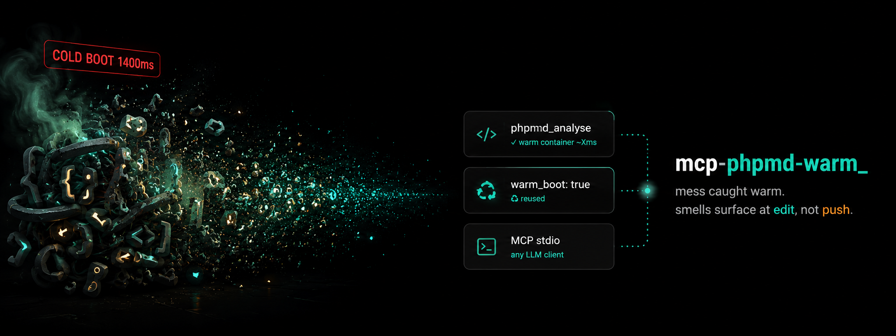

<p align="center">
  
</p>

# mcp-phpmd-warm

> **Stop paying [PHPMD](https://phpmd.org/)'s cold-start tax on every edit.**
> A warm-process [MCP](https://modelcontextprotocol.io/) server that keeps PHPMD's classes + parsed rulesets hot. ~24× faster per call. Works with every MCP client.

[](https://github.com/Digital-Process-Tools/mcp-phpmd-warm/actions/workflows/tests.yml)
[](https://packagist.org/packages/dpt/mcp-phpmd-warm)
[](https://www.php.net/)
[](LICENSE)

[Why](#why) • [Install](#install) • [Use it](#use-it) • [Benchmark](#benchmark) • [Compatibility](#compatibility) • [How it works](#how-it-works) • [FAQ](#faq)

---

## Why

[PHPMD](https://phpmd.org/) catches the smells that break a build at the finish line — excessive complexity, god classes, unused code, naming violations. The catch: those smells usually surface only at **pre-push**, long after the edit that caused them. By then it's a fix-amend-repush cycle instead of a one-line decision made while the code is still warm in your head.

Wiring PHPMD into the edit loop fixes that — except every `phpmd foo.php` pays the same toll: interpreter boot, autoloader, ruleset XML parse, PHPDepend warm-up. Cheap once, expensive 100 times.

`mcp-phpmd-warm` runs PHPMD inside a long-lived PHP process. **First call pays the boot once. Every subsequent call reuses the hot interpreter, opcache and autoloader.**

## Install

```bash
composer global require dpt/mcp-phpmd-warm
```

Makes `mcp-phpmd-warm` available on `$PATH`.

Requires PHP 8.2+. Pulls PHPMD ^2.15 as a real Composer dep.

## Use it

### Claude Desktop

Edit `~/Library/Application Support/Claude/claude_desktop_config.json` (macOS) or `%APPDATA%\Claude\claude_desktop_config.json` (Windows):

```json
{
  "mcpServers": {
    "phpmd": {
      "command": "mcp-phpmd-warm",
      "args": [
        "--working-dir=/path/to/your/project",
        "--rulesets=cleancode,codesize,design,naming,unusedcode"
      ]
    }
  }
}
```

Restart Claude. Ask: *"Run PHPMD on src/Foo.php"*.

`--rulesets` accepts PHPMD's built-in ruleset names **or** absolute paths to custom ruleset XML files (or any mix). Omit it to use PHPMD's defaults.

### Cline / Continue / Cursor / Zed / any MCP client

Same `command` + `args` shape. The server speaks plain MCP over stdio — no client-specific glue.

### Standalone

```bash
mcp-phpmd-warm --working-dir=/path/to/project --rulesets=cleancode,design,naming
```

Reads MCP JSON-RPC on stdin, writes responses on stdout.

## Benchmark

Measured on a small PHP file with 5 rulesets (`cleancode,codesize,design,naming,unusedcode`):

| Setup | Per-call wall | Notes |
|-------|---------------|-------|
| Cold phpmd CLI | ~315ms | interpreter + autoload + ruleset parse each time |
| **mcp-phpmd-warm (warm)** | **~13ms** | classes + opcache hot, rulesets rebuilt per call |
| Daemon cold boot | ~90ms | paid **once** at server start |

**~24× faster per call.** Numbers vary with project size and ruleset count. The win is cold-start amortization, not magic — and PHPMD is a lighter tool than Rector or PHPStan, so its absolute cold cost is smaller to begin with.

## Compatibility

| Client | Status |
|--------|--------|
| Claude Desktop | ✅ stdio MCP |
| Cline (VS Code) | ✅ stdio MCP |
| Continue (VS Code / JetBrains) | ✅ stdio MCP |
| Cursor | ✅ stdio MCP |
| Zed | ✅ stdio MCP |
| Custom (Python/Node/Go MCP clients) | ✅ standard protocol |

Any client that speaks MCP stdio works. No custom protocol.

## Tools exposed

### `phpmd_analyse`

Run PHPMD mess detection on a path. Rulesets are server-pinned (`--rulesets`).

| Argument | Type | Default | Description |
|----------|------|---------|-------------|
| `path` | string | required | Absolute path to a file under the working dir |

Returns:

```json
{
  "exit_code": 0,
  "output": "{...PHPMD JSON report...}",
  "warm_boot": true
}
```

`exit_code`: `0` clean, `2` violations found, `-1` error. `warm_boot: true` ⇒ hot process reused. `false` ⇒ first call (cold boot just finished). `output` is PHPMD's JSON renderer payload.

## How it works

Three decisions worth knowing:

1. **One daemon per project, not per call.** Working dir + rulesets pin at server startup (`--working-dir`, `--rulesets`). The process stays alive, so the expensive part — loading hundreds of PHPMD + PHPDepend classes — happens once.

2. **No container to cache — PHPMD has none.** Unlike Rector, the win here is purely the persistent interpreter: opcache and the autoloader stay hot. There's nothing stateful to keep warm beyond that.

3. **Rulesets are rebuilt per call, on purpose.** Some PHPDepend rules accumulate per-run state, so reusing `RuleSet` objects across files would leak violations from one file into the next. Ruleset XML parsing is cheap relative to the boot cost already amortized, so each call gets a fresh `RuleSetFactory` + `Report` + renderer. Verified leak-free by test.

## FAQ

**Does this replace `vendor/bin/phpmd`?** No. Use it from MCP clients (Claude Desktop, agents). For one-off CLI calls the regular binary is still simpler.

**Can I use my project's custom ruleset XMLs?** Yes — pass their absolute paths in `--rulesets`, comma-separated, mixed freely with built-in ruleset names.

**Why rebuild rulesets every call if it's a *warm* server?** Correctness beats a few ms. The dominant cold cost is class loading, not ruleset parsing, and that's what the persistent process eliminates.

**Memory?** The daemon sets `memory_limit = -1` like PHPMD's own CLI. Idle daemon is small — PHPMD is a lighter dependency tree than Rector.

**Does it survive PHPMD version updates?** It uses PHPMD's stable public API (`PHPMD::processFiles`, `RuleSetFactory`, `JSONRenderer`). Pin a PHPMD version in your own `composer.json` if you need determinism.

## Credits

- **[PHPMD](https://github.com/phpmd/phpmd)** by Manuel Pichler and contributors — the mess detector doing the real work.
- **[PHPDepend](https://github.com/pdepend/pdepend)** — the parser PHPMD is built on.
- **[Model Context Protocol](https://modelcontextprotocol.io/)** by Anthropic — the protocol that makes this kind of tool integration possible.
- **[mcp/sdk](https://github.com/modelcontextprotocol/php-sdk)** — official PHP SDK, used here for stdio transport + tool discovery.

## Related

- **[PHPMD docs](https://phpmd.org/documentation/index.html)** — rules, rulesets, custom XML.
- **[PHPMD on Packagist](https://packagist.org/packages/phpmd/phpmd)** — the upstream package.
- **[mcp-rector-warm](https://github.com/Digital-Process-Tools/mcp-rector-warm)** • **[mcp-phpstan-warm](https://github.com/Digital-Process-Tools/mcp-phpstan-warm)** • **[mcp-phpunit-warm](https://github.com/Digital-Process-Tools/mcp-phpunit-warm)** — the sibling warm-process servers.
- **[claude-supertool](https://github.com/Digital-Process-Tools/claude-supertool)** — DPT's batched-ops Claude Code companion; integrates this server as a validator.

## License

Community License — see [LICENSE](LICENSE). Built by [Digital Process Tools](https://github.com/Digital-Process-Tools).
